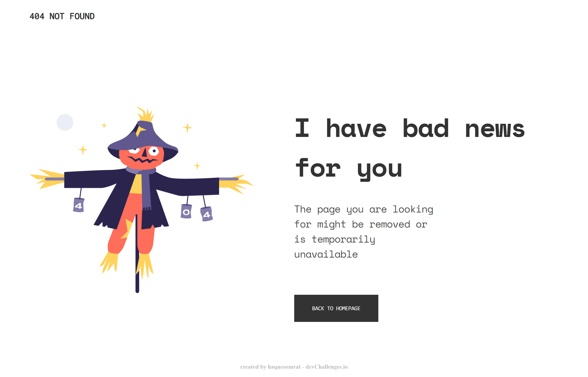

<!-- Please update value in the {}  -->

<h1 align="center">404 not found</h1>

   Live Site:  <a href="https://404-not-found-inj.netlify.app/" target="_blank">404-not-found</a>.

<!-- OVERVIEW -->

## Overview

